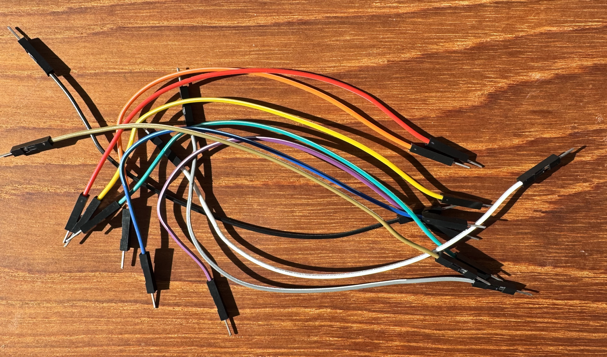

# Lab Kit

Please make sure you have the following items in front of you. 

(Clockwise from the top of the image below):
* USB Cable 
* Green Light Emitting Diode (LED)
* 30 Position Breadboard 
* 10 Jumper Wires
* DF Robot Arudino Nano development board
* DF Robot Micro Servo motor
  
USB-C adapters are available.  Please ask for help if you are missing any of the above parts or need a USB cable adapter for your laptop.  

Separate the jumper wires so that you have 10 separate wires:

Line up the Arduino Nano board with the breadboard so it resembles the image below.  Try to hold the board by the four corners (where the holes in the board are).  Try not to touch the metal pins on the Arduino Nano board or the electronic parts on the top of the board as you do this (it is okay if you do, but better for the longevity of the Arduino Nano board if you do not):

Again try to use the four corners of the board (rather than pressing down on top of the board, where all of the electronic parts are) and *press down firmly and evenly* to seat the Arduino Nano board into the breadboard.  

***Be careful not to press your fingers onto the six pins sticking up off of the board.  These pins are pointy on the top.  It will hurt if you press your fingers on them!!!***

You can leave the Arduino Nano board in the breadboard forever.  Doing so will protect the pins on the bottom of the Arduino Nano board from being touched / bending in storage, and it is difficult to remove the Arduino Nano board from the breadboard without damaging the Arduino Nano board.

Your lab kit is ready for use.

Note that we will also work with resistors.  There are two SparkFun resistor kits available in the lab to be shared by all:

---
(For Dr. McKeon:)

Items were ordered from https://www.digikey.com

