# Blinky

"Blinky" is the cannonical first embedded systems project.  As the name suggests, you will blink a light emitting diode ("LED") by toggling a general purpose input/output ("GPIO") pin high and low.

You should already have the blinky code project from [earlier preparation work](../README.md).  In this experiment you will connect your board, update a few configuration settings specific to your laptop and the version of the board you are using, then upload and run your blinky code project!

Start by opening your blinky.ino code project in the Arduino IDE.  Your IDE should resemble the following:

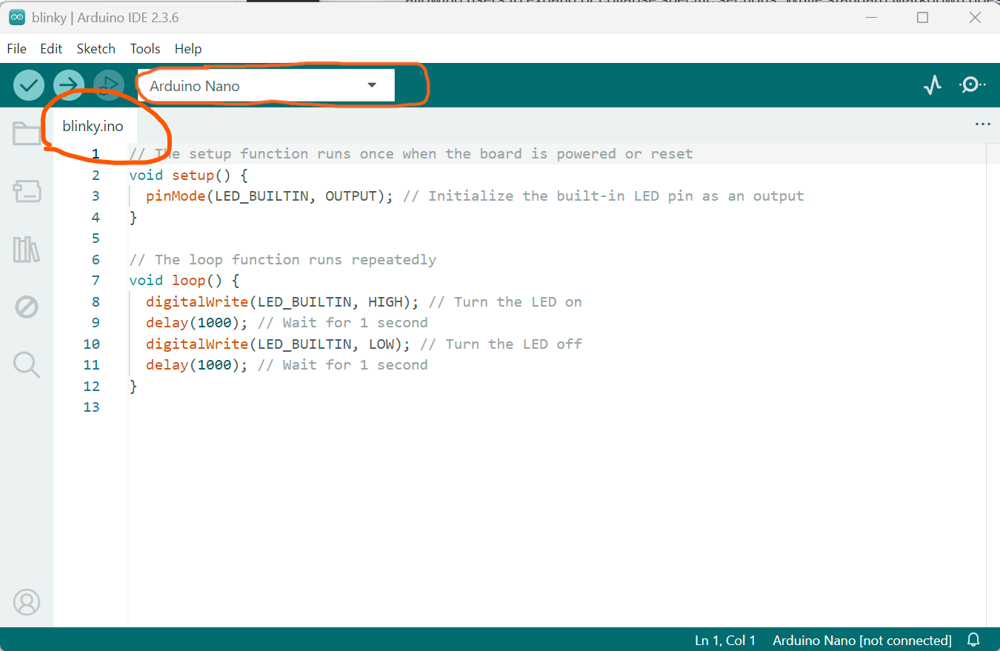

Verify the name of your sketch is "blinky.ino" and that the "Arduino Nano" board is selected.

***Do not connect your Arduino Nano Board yet*** (or if it is connected, disconnect it).

The first task is to figure out which communications port (COM Port) the Arduino Nano board is connected to (when we connect it).  There are various ways to go about this.  I like to look at the list of available ports without the board connected, then connect the board, and look at the list again.  Whichever new port shows up is the port for the Arduino Nano board.  

Start with your Arduino Nano board *disconnected*, click on the board drop-down list, and see which ports are listed to the right:

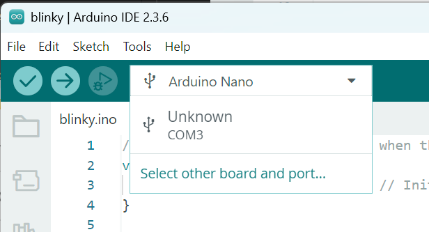

In my cast, with my Arduino Nano board disconnected, I only have the "COM3" communications interface available.

***Now connect your Arduino Nano Board to your laptop/computer via the USB interface and a USB cable***  

This time when you click on the board drop-down list you should see another communications interface listed.  In my case the new interface is "COM4".  This is the communications interface for the Arduino Nano Board:

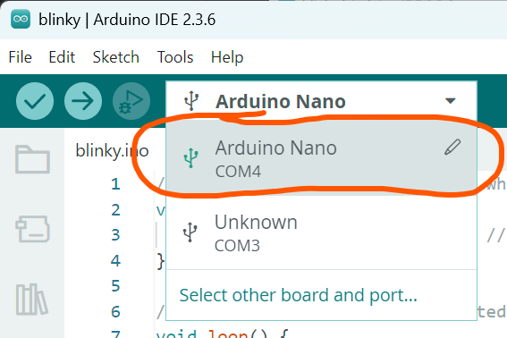

Note: if this is the first time you are connecting your Arduino Nano Board to your computer it may take a few seconds for the board to appear in the list.  Close the drop-down list, wait a few more seconds, and try again.  If it still does not appear let me know and we'll figure it out. 

***If the new port appears, but it is listed as "UNKNOWN", then you need to "Select other board and port" to tell the Arduino IDE that an Arduino Nano Board is connected to the new port - you only need to do this if the new port is type "UNKNOWN" - if the new port is listed as "Arduino Nano" you do not need to do this***:

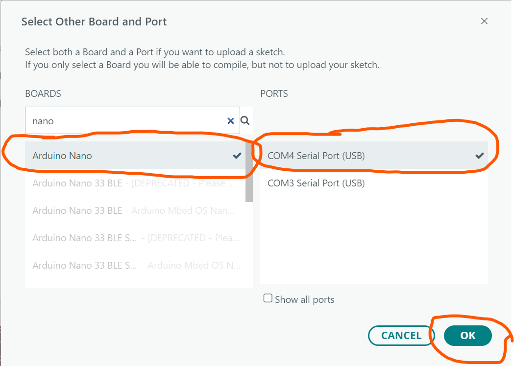

When everything is configured correctly the board type will have the USB symbol next to it.  If you do not see this symbol the Arduino Nano Board is not properly configured/connected to the Arduino IDE - it is time to ask for help :)

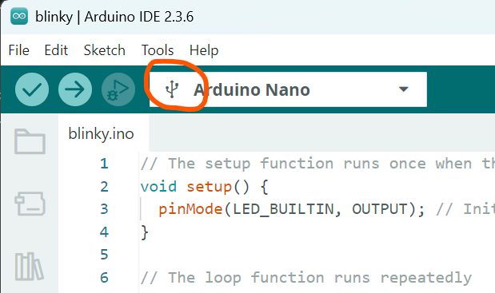

Next, we need to tell the Arduino IDE that the Arduino Nano Board is using the "Old Bootloader."  The Bootloader is what enables us to upload and run our code projects from the Arduino IDE to the Arduino Nano Board.  We have to make this change because I am cheap and purchased a low-cost clone of the Arduino Nano made by DF Robotics... the DF Robotics version of the Arduino Nano uses an older bootloader.  

Click on the Tools menu and select the "Processors" menu item.  Change the processor from ATmega328P to ATmega328P (Old Bootloader).

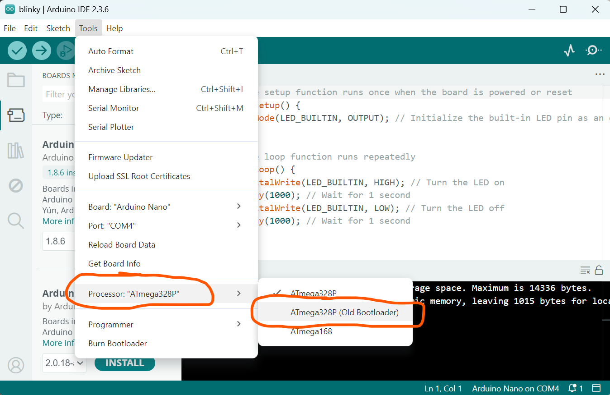

Double-check that you made this change by clicking on the Tools menu again, selecting the "Processors" menu again, and verifying that there is a checkmark next to the "ATmega328P (Old Bootloader) option:

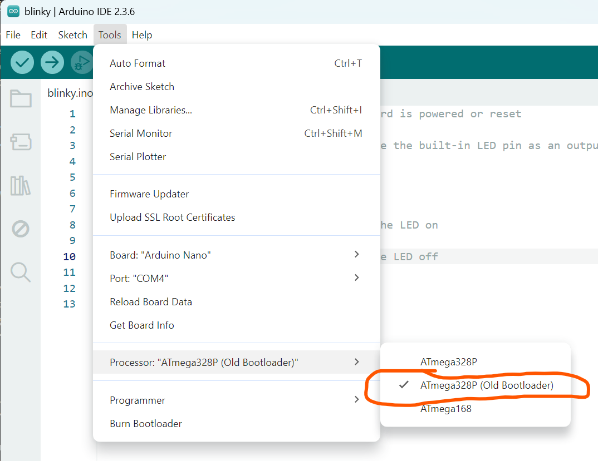

Ready to upload your blinky program to the Arduino Nano?  I think so!  Click on the "upload" icon to start the upload:

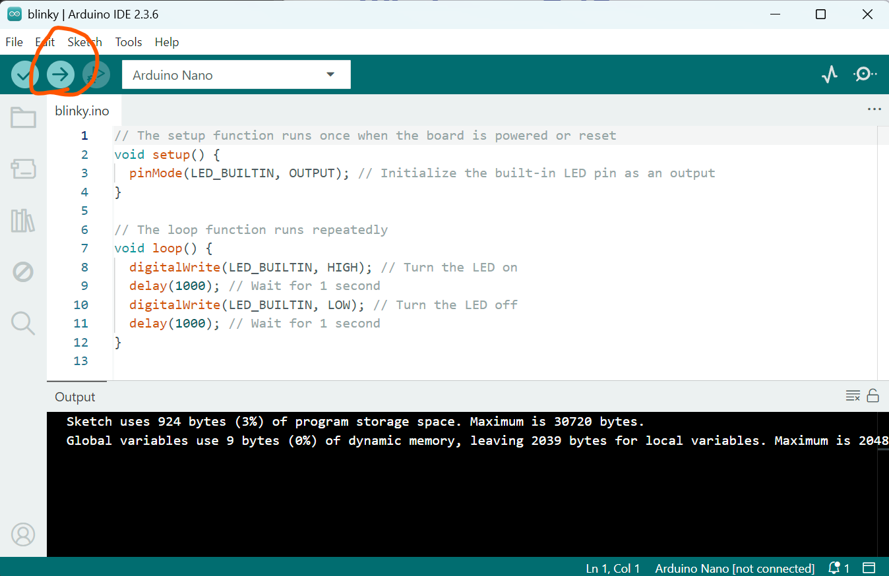

This may re-run the verification step ("Compile") and then will start the upload process:

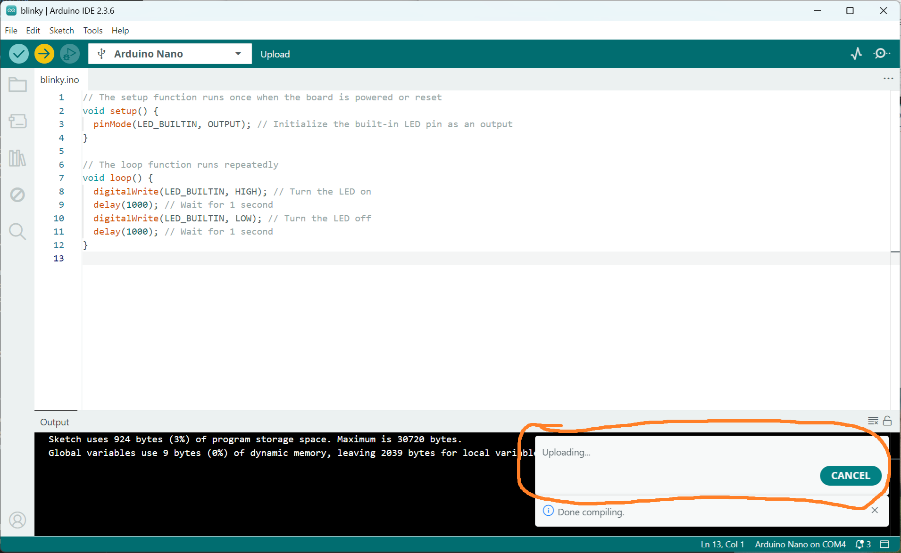

When the upload finishes take a look at your Arduino Nano Board - its "Built In" green LED should be blinking on and off with a total time to complete one cycle ("period") of 2 seconds or, equivalently, at a frequency of $1 / period = 0.5$ Hz (pronounced "hertz"):

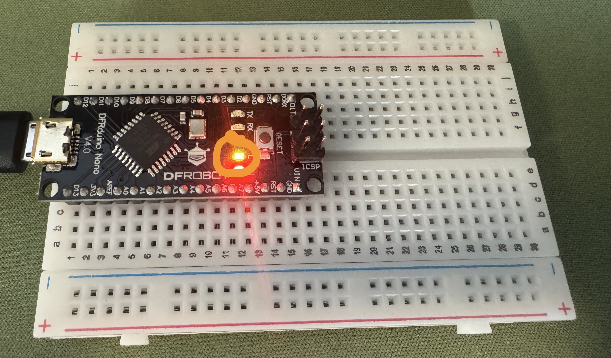

NOTE: if your Arduino IDE gets stuck at "Upload" for a long time and/or fails with a message like the following then you did not successfully change the bootloader from ATmega328P to ATmega328P Old.  Repeat the steps above to make sure the bootloader settings are updated.

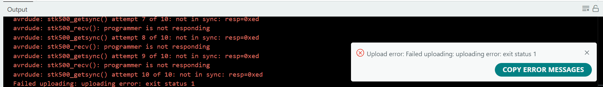

---

How is it that, with a few lines of code, you can make something happen in the physical world?  (Yeah, I know, it is just a blinking LED... but: crawl, then walk, then run...)

Your code is running on the Arduino Nano Board's microcontroller chip, shown below:

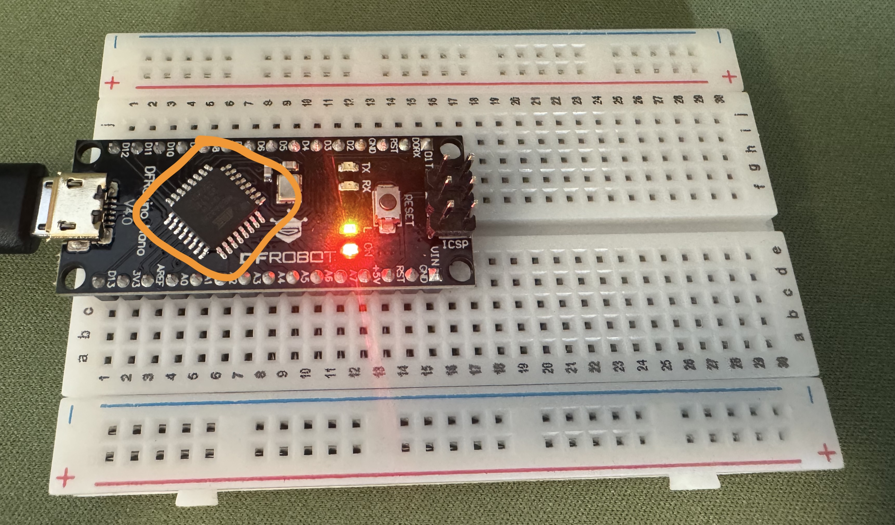

Notice that the microcontroller has 32 metal legs - eight on each side.  These are the microcontroller's *pins*.  Some of the microcontroller's pins connect to the USB interface on the left - this is how the microcontroller communicates with your computer and the Arduino IDE:

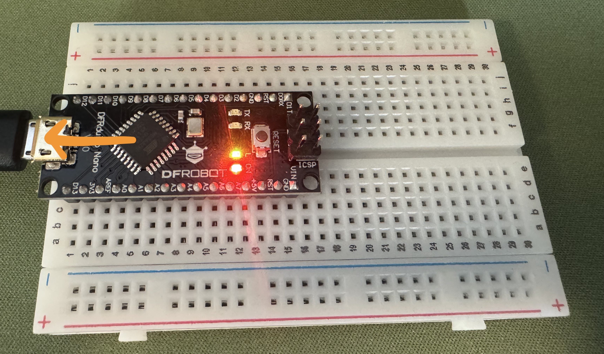

Some of the microcontroller's pins connect to the pins on the edge of the Arduino Nano Board - we will use these later:

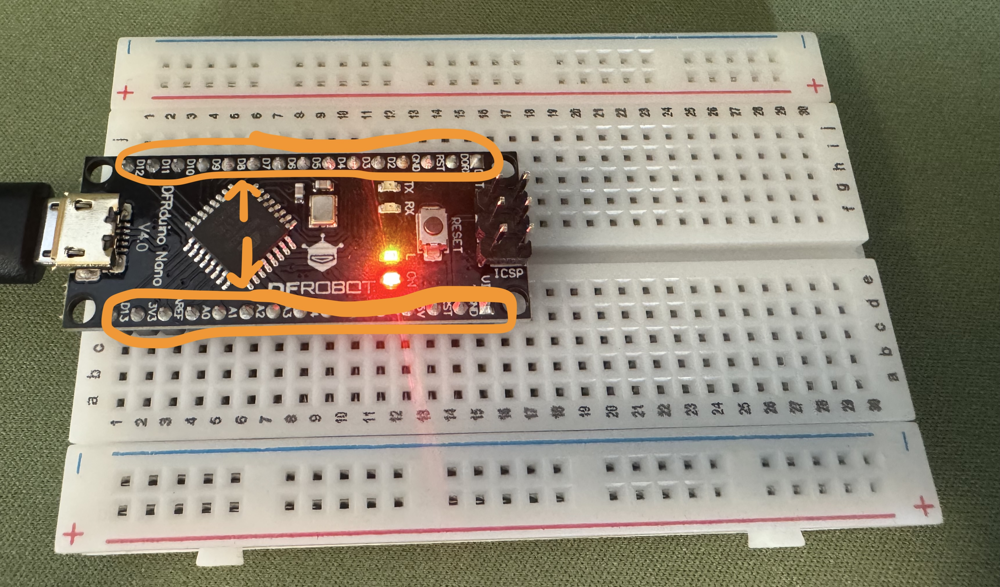

One of the microcontroller's pins connects to the green light emitting diode ("LED") on the Arduino Nano Board:

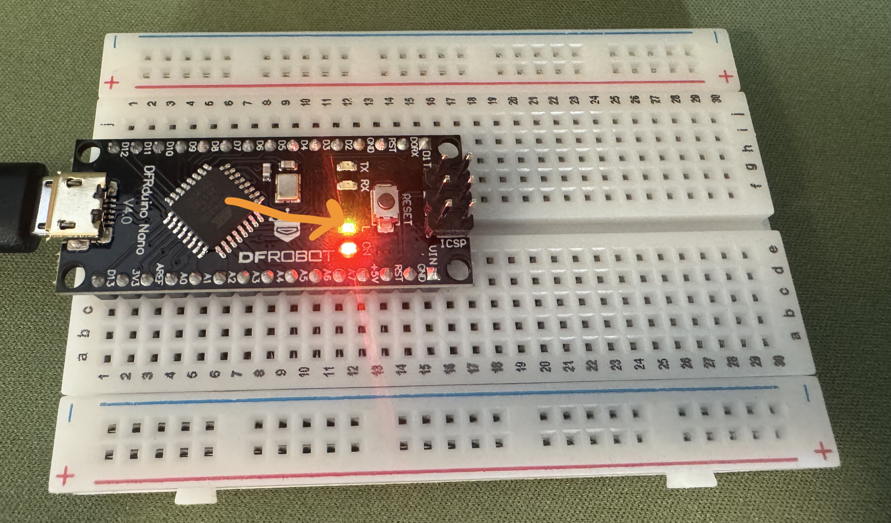

Now look at your code in the Arduino IDE editor. 

There are two top-level *functions*, setup() starting on line 2 and loop() starting on line 7.  

The code in the setup() function runs when the microcontroller is *reset* - either by disconnecting and reconnecting the power or by the Arduino IDE after your code is uploaded. 

Setup() calls a single function, pinMode().  This function takes two *arguments*, provided inside the parentheses.  The first argument is the pin whose mode we wish to set... in this case the pin connected to the green LED on the Arduino Nano Board.  The Arduino IDE knows that there is a built-in LED because you told it you are using the Arduino Nano board, so you can specify the pin with the label "LED_BUILTIN."  The second argument is the mode.  Many of the microcontroller's pins support multiple modes: digital input, digital output, and analog input to name a few.  Here we are setting the microcontroller pin connected to the built-in LED to its (digital) output mode.

After the code in setup() is run, the microcontroller will run the code in the loop() function, over and over, forever (which is why it is called the "loop" function).

In our loop function the code on line 8 sets the *state* of the microcontroller's pin connected to the built-in LED to *high* or, electrically, sets the *voltage* on the pin to the highest possible value - which is about 3.3 volts.  If you do not know what volts are, don't worry.  We'll talk about it.  But when the output state of this pin is high the LED is illuminated.

The code on line 9 calls a time delay function, delay(), with an argument of 1000.  This argument is in units of milliseconds, or $1/1000$ of a second.  As a result, this line of code tells the microcontroller to "wait one thousand milliseconds" or "one second." 

After this the code in lines 10 and 11 should be intuitive.  Turn the LED off, then wait another second.  

And then loop() is called again, and again, and again... blinking the LED forever.

Let's add three more terms to the list, as we'll use them in the next few experiments, and then I'll give you two coding challenges to tackle with the blinky project:

The LED is on for one second, then off for one second.  This means the total time to complete one "blink" (on and off) is two seconds.  We refer to the total time for one cycle as the cycles *period*.  Blinky currently blinks with a period of 2 seconds.

We can also talk about this cycle in terms of its *frequency* - how many times the cycle completes in one second.  Frequency is simply $1 / period$ and is in units of Hz ("Hertz").  Blinky currently blinks with a period of 0.5 Hz.

The last term relates to the ratio of "on" time vs. the total period.  Right now the LED is on for 1 second and the total period is 2 seconds, so the ratio is 0.5.  This ratio is called the *duty cycle* and we would say it has a duty cycle of 0.5 or, equivalently, 50%.

Coding challenges:

* Modify your code so that blinky blinks at a frequency of 1 Hz.

* Modify your code so that blinky blinks at a frequency of 1 Hz with a 20% duty cycle.

(After each code change, click the "Verify" button, then click the "Upload" button, then look at your LED - did you acheive the desired result?)
