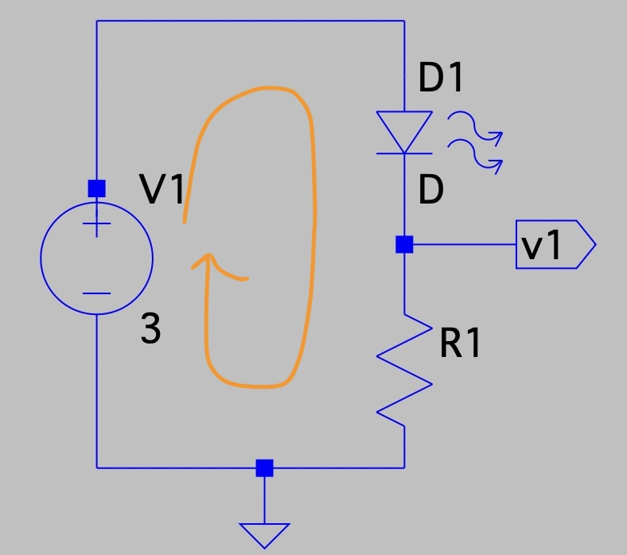
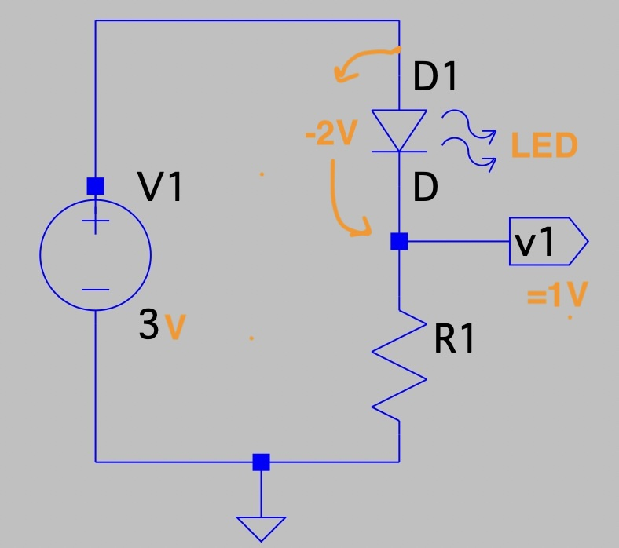
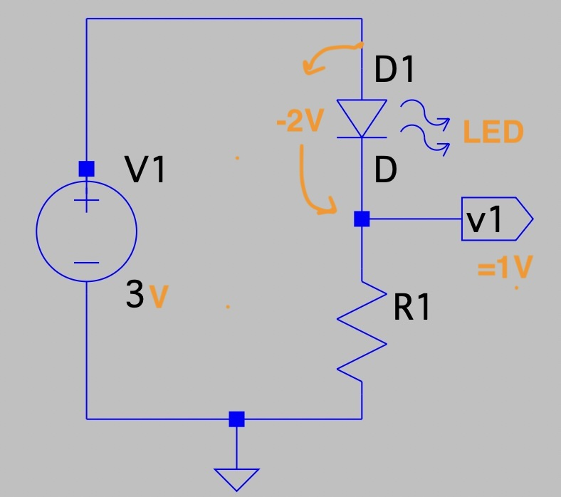
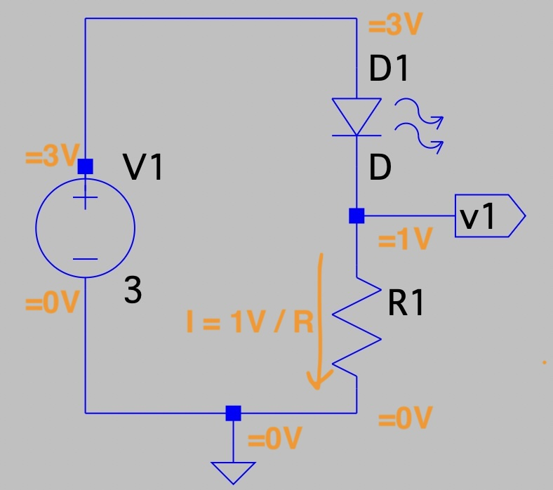

# Volts, Amps, and Ohms

In this experiment you will design an electronic circuit to control the "current" flow through a light emitting diode (LED) to prevent from "burning the LED out" with too much current.

A circuit is a "loop" through which electricity (in the form of electrons) flows.  Here is the circuit you will design and build - the main thing to take away from this image is that it is a loop:

The flow of electrons can be thought of in much the same way as one imagines water flowing *through* pipes.  In the case of water one might say it is flowing at a rate of "1 gallon per minute" through a pipe.  In the case of electrons, we say it has a *current* of "1 Amp".  An Amp is defined as "1 Coulomb" or $6 x 10^{18}$ electrons per second.  **The key idea here is that *current* is a "through" variable... it describes the flow of electrons *through* something... a wire... a resistor... an LED...** 

What causes these electrons to flow?  An *electric potential*.  This is similar to how a difference in water pressure, due perhaps to the use of a water pump, causes water to flow through a pipe.  In the case of electricity we use batteries and generators to create electric potential.  This electric potential is called *voltage* and is measured in units of *volts*.  **The key idea here is that *voltage* is an "across" variable... it describes the potential across something (a wire... a resistor... an LED...) and this potential *across* that thing is what inspires current to flow *through* it.**

Going back to our circuit, on the left the circle with the + and - inside of it is a power supply.  In this case it provides a constant *voltage* of 3 volts *across* it.  

Going clockwise from the power supply we have "D1"... this is a "diode" and the squiggles next to it mean it is a "light emitting diode" (there are diodes that do not emit light).  A diode's general behavior is that it only allows current to flow in one direction... the triangle points in the direction the current will flow.  

Our green LED diode's specific properties are that it consumes 2 volts of the voltage potential across it (we say it "drops" 2 volts).  It will allow as much current to pass through it as the circuit wants, but we have to be careful here.  Our diode creates both light and heat as current flows through it... and if we let too much current go through the diode it will create too much heat and "burn out" the diode:

What do we know so far? The power supply on the left creates three volts of electric potential, and the diode consumes (or drops) two of these volts... so at the dot in our circuit with the label "V1" sticking out next to it the remaining electric potential back to the power supply is 1 volt.  But, so far, nothing determines how much current is flowing through the circuit.  Can you guess what the last element does?

The last element is a resistor and, as the name implies, it "resists" the flow of current through it.  The relationship between the voltage across a resistor and the current through it is described by a simple equation, called Ohm's law, where V is in volts, A is in amps, and R is the resistance of the resistor measured in ohms:

Ohm's Law: $V = I * R$ (Voltage = Current times Resistance)

Or, equivalently: $I = V / R$ (Current = Voltage divided by Resistance)

So the current through our circuit - the current is the same everywhere - is $I = 1 / R$.  

If V is 1 volt and R is 1000 Ohms, which we also write with the Greek symbol Omega as 1000 $\Omega$, then our current is 0.001 amps.  

We use metric symbols quite a bit to make the numbers more compact, we we might equivalently say "if R is 1 kilo-ohm (1 $k\Omega$) then our current is 1 milli-amp (1 $mA$).  

---

Quick review of the key ideas:

A circuit is a loop around which electrons flow. 

Voltage is the electric potential that causes electrons to flow.  The power supply increases the potential across it by +3V.  The diode decreases (drops) the potential across it by 2V.  This means there is 1V across the resistor.

Current is the flow of electrons through a circuit.  The current is the same for all elements in a circuit.  In our circuit the resistor establishes the current in the circuit with the relationship I = V / R.

---

Design challenge: 

Determine which resistor value to use to restrict the flow of current through the diode to 15 $mA$ (0.015 A).

