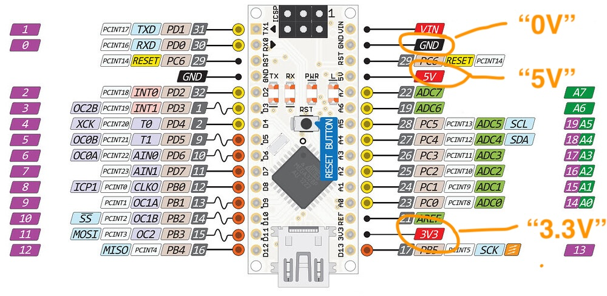
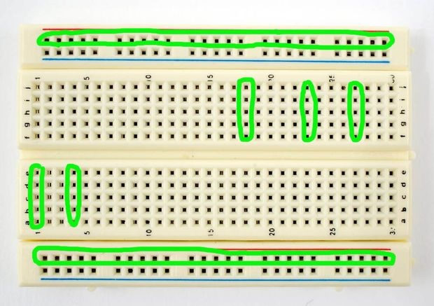
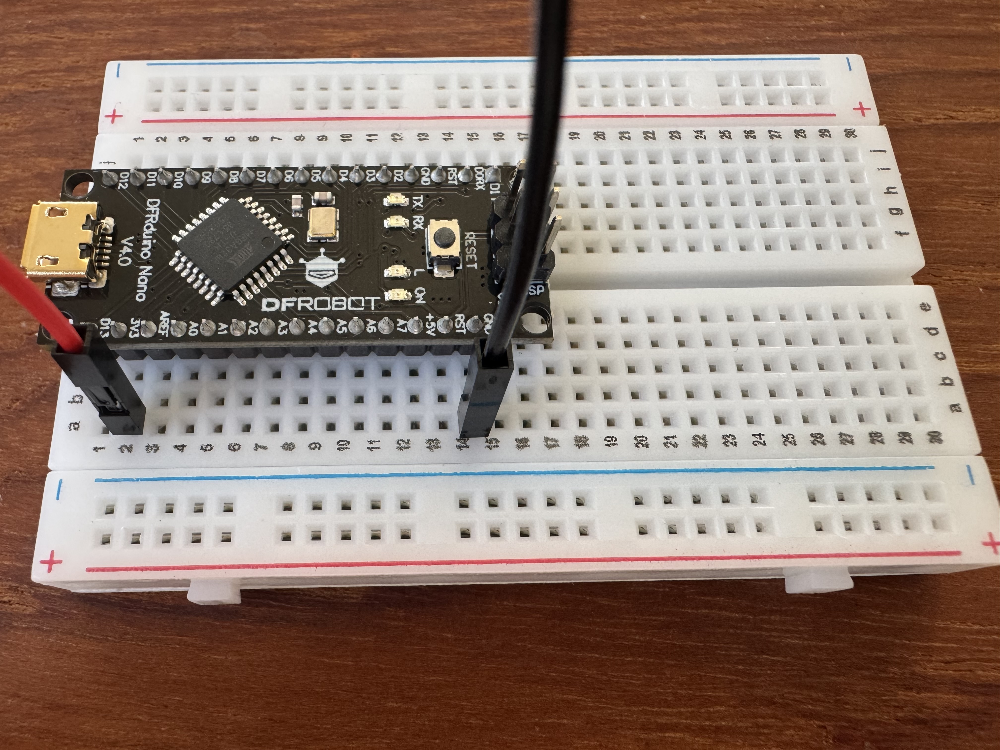
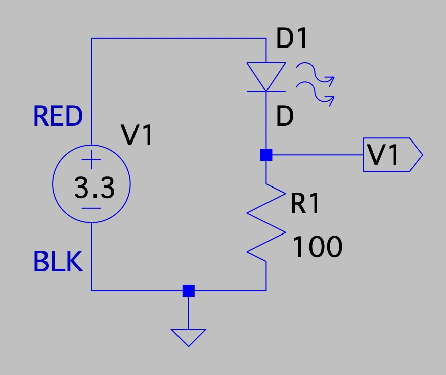
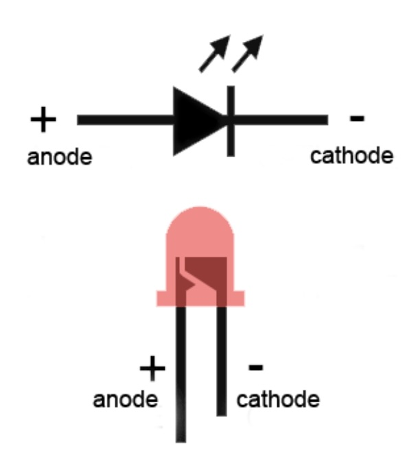
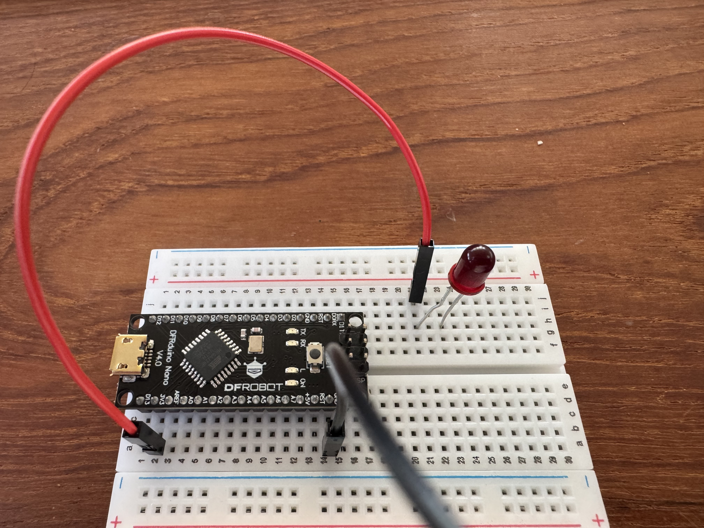
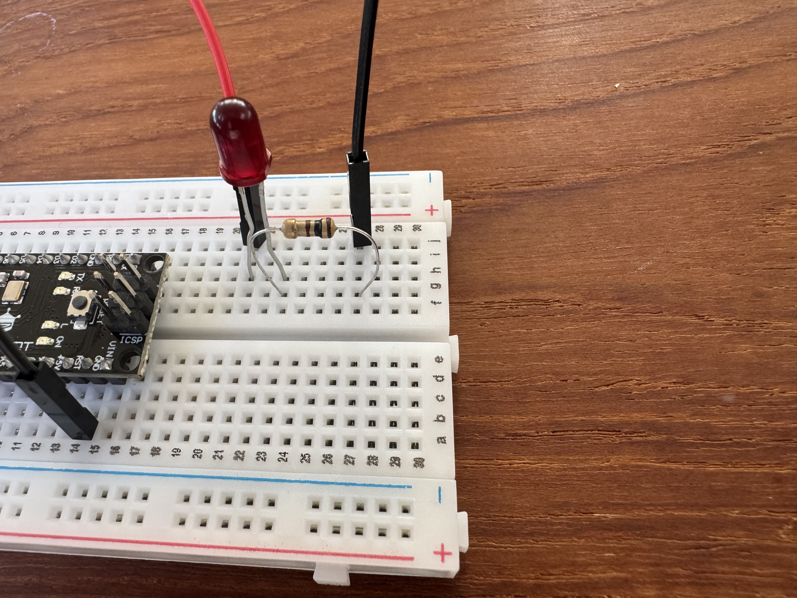
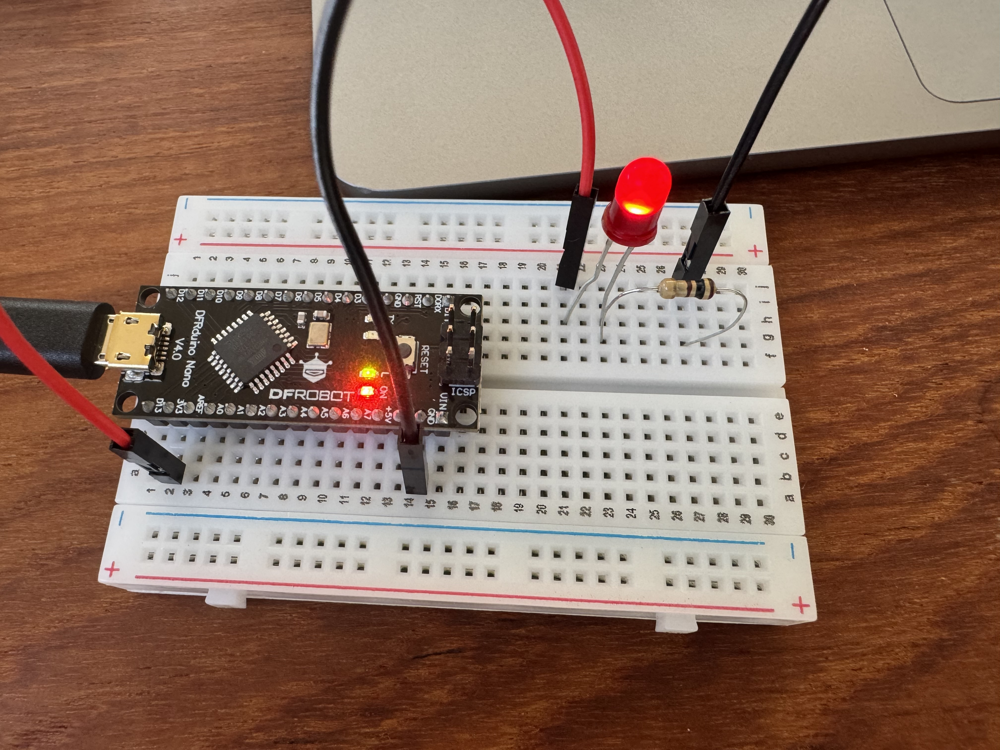

# Build the LED Circuit

In this experiment you will build the circuit with your computed resistor value and, if your design is correct, your LED will thank you for not burning it out with too much current!

We will use the Arduino Nano as our power supply.  The Arduino Nano has 30 external pins, many of which have multiple functions (depending on how you program it).  A couple of these pins are dedicated power supply pins for use with external circuit:

You can connect circuit elements together on your breadboard by inserting wires or element (LED, resistor) leads into holes in the breadboard.  The holes in your breadboard are electrically connected as shown in the image below.  Specifically:
* The vertical columns of 5 holes on the top half are connected together
* The vertical columns of 5 holes on the bottom half are connected together (but they are not connected to the top half!)
* The horizontal rows are connected together.

***NOTE: disconnect the USB cable from your Arduino Nano while modifying your circuits!  Modifying a circuit while it is powered is an excellent way to damage your Arduino Nano!***

Based on the pinout diagram above, we can connect wires to the "0V" and "3.3V" pins by inserting them into the vertical columns above #2 and #14 in the bottom half of the breadboard.  Wire color doesn't matter, but it is a common convention to use black for "0V" (also called "ground"), and red for the positive side of a power supply - 3.3V in our case:

Here's how that maps to the schematic (updated for a 3.3V power supply):

Next, recall that the diode only allows current to flow in one direction... we have to insert it into the circuit in the correct orientation!  LEDs like the one in your hardware kit have different length leads on them to help get the orientation right:

So we want to connect the long lead to the red wire.  Here's my board (note I am using a red LED, not a green LED... I'm traveling and that is all I have with me...).  It doesn't matter which two vertical columns you use for this, provided they are empty to start with (not a column with an Arduino Nano pin in it):

Next we're ready to add the resistor.  First update the math for a 3.3 Volt power supply:

$V = I * R$

$R = V / I$

$R = (3.3 - 2.0) / 0.015$

$R = 87\Omega$

Resistors do not come in all values, however.  Our kit doesn't have an 87 $\Omega$ resistor, so we'll use the next size up: 100 $\Omega$.  

When you look in the resistor kit, however, you won't find labels on them saying things like "100 $\Omega$"... instead you have to use a standard color chart to figure out what your resistor value is or, in our case, to figure out which color bands you are looking for.  Here's the standard color chart:

We're looking for 100 $\Omega$ so we're looking for the color pattern brown-black-brown for "1" "0" x "10" = 100.  

Find a 100 $\Omega$ resistor and connect it between the "-" lead of the LED and the "0V" pin on the Arduino Nano (using the black wire) to complete the circuit:

Now, if everything is correct (are you sure about your resistor value?  If it is too small you will burn out the LED!), when you connect the USB connector from your laptop to the Arduino Nano board you will turn on the 3.3V power supply and your LED should light up (yours will be green, of course):

If everything is working, next try moving the red wire from vertical column #2 under the Arduino Nano board to vertical column #1 (move it one column to the left).

What do you observe?

Why do you think this is happening?

