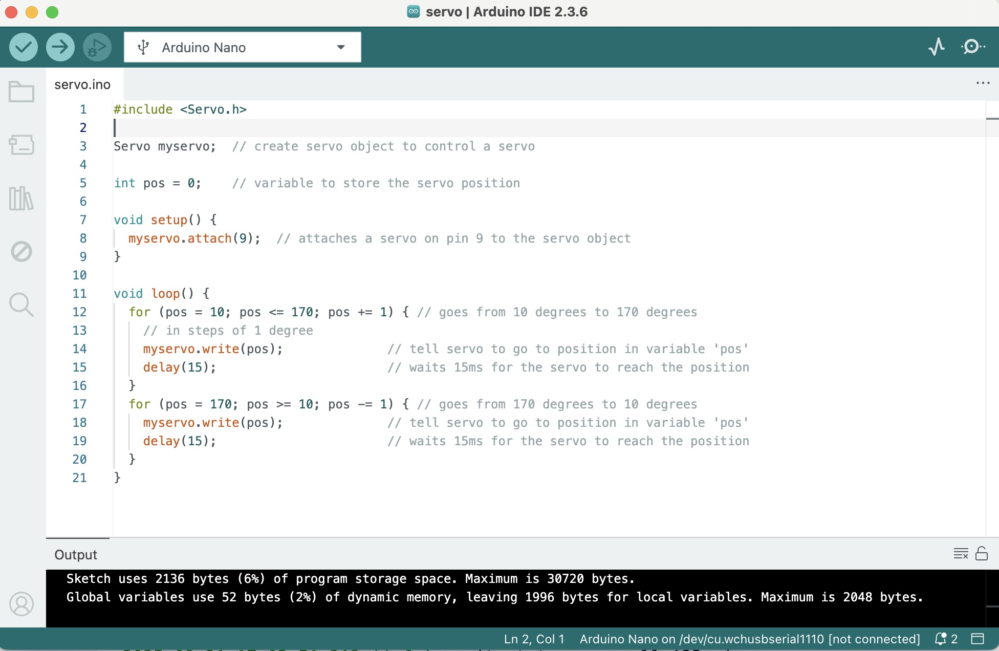

# Servo Motors

In this experiment you will use Pulse Width Modulation (PWM) to control the position of a servo motor.

Remember when we were playing with the on and off time of the LED back in "Blinky"?  That was pulse width modulation.  We were manually specifying the "high" and "low" times of the output signal using delay() function calls using the microcontroller's processor.  

One of the key features that makes a microcontroller a "microcontroller" is the presence of on-chip peripherals useful for interacting with the physical world.  PWM signals are useful for interacting with the physical world (via e.g. servo motors).  We can be a lot more efficient about creating PWM signals by using a feature of the on-chip "timer" peripherals to let hardware generate our signals for us:


Servo motors are controlled by a 50 Hz PWM signal.  Recall that the signal's period is 1 / frequency, so the period of the 50 Hz PWM signal is 20 ms (0.020 seconds).  If, during this period, the signal is high for 0.5 ms (0.0005 seconds), the servo motor is rotated to its maximum counter-clockwise position.  If the signal is high for 2.5 ms (0.0025 seconds), the servo motor is rotated to its maximum clockwise position.  By adjusting the high time of the PWM signal, one can control the position of the servo motor:


Start by saving your blinky sketch as "servo" and replacing the code with the following:

```
#include <Servo.h>

Servo myservo;  // create servo object to control a servo

int pos = 0;    // variable to store the servo position

void setup() {
  myservo.attach(9);  // attaches a servo on pin 9 to the servo object
}

void loop() {
  for (pos = 10; pos <= 170; pos += 1) { // goes from 10 degrees to 170 degrees
    // in steps of 1 degree
    myservo.write(pos);              // tell servo to go to position in variable 'pos'
    delay(15);                       // waits 15ms for the servo to reach the position
  }
  for (pos = 170; pos >= 10; pos -= 1) { // goes from 170 degrees to 10 degrees
    myservo.write(pos);              // tell servo to go to position in variable 'pos'
    delay(15);                       // waits 15ms for the servo to reach the position
  }
}
```

Your Arduino IDE should resemble the following:



The above code uses the "Servo" library to provide a friendly interface to the on-chip timer's PWM capabilities.  The setup() function sets up a servo interface to a servo motor control signal on "Digital Pin #9" (we'll come back to that).  The loop() function changes the value of a variable called "pos" from 10 to 170 and back to 10 before repeating.  It uses delay() function calls to pause the servo motor at a given position before updating it to the next one.

Verify that your code builds.  Then unplug your USB cable while you wire up the servo motor.  First, press one of the attachments that comes with your servo motor onto the motor shaft... this makes it easier to see what position the servo motor is in:


Next, from the Arduino Nano pinout guide:
* 0V is on the breadboard's bottom vertical column #14
* +5V is on the breadboard's bottom vertical column #12 
* "D9" is on the breadboard's top vertical column #4


Connect a red jumper wire to +5V, a black jumper wire to 0V, and an orange jumper wire to D9.  Then connect the free ends of the jumper wire to the servo motor's connector, with:

| Signal | Arduino Nano Jumper | Servo Connector |
|--------|---------------------|-----------------|
| +5V    | Red                 | Red             |
| 0V     | Black               | Brown           |
| Control| Orange              | Orange          |

Your project should resemble the following:


Connect the Arduino Nano to your computer via the USB cable and upload your sketch.  Did it work?

* Try changing the sleep() time from 15 to 3.  What happens and why?
* Try changing the sleep() time from 3 to 200.  What happens and why?
* Try changing the increment size in the for() loops from '1' to '20'.  What happens and why?