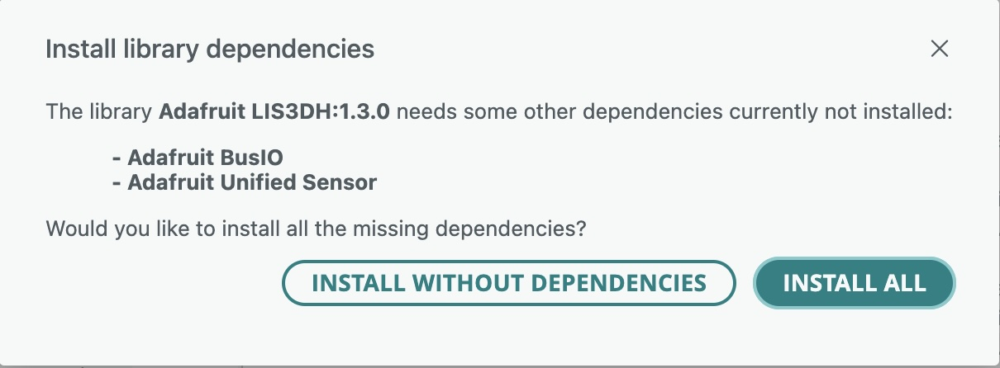

# Accelerometer

In this experiment you will connect an LIS3DH 3-axis accelerometer to the Arduino Nano and, using the LIS3DH library from Adafruit, observe acceleration data using the serial monitor as you tilt the board.  

Start by installing the Adafruit LIS3DH library.  Click on the "library" icon in the Arduino IDE and search on "lis3dh."  Select the "Adafruit LIS3DH" library from the search results and click "install":


The installation process may require other libraries to be installed.  If so, click "install all" when prompted:



Create a sketch with the following code:

```
// Read acceleration data from an LIS3DH, use to control a servo position

#include <Wire.h>
#include <SPI.h>
#include <Adafruit_LIS3DH.h>
#include <Adafruit_Sensor.h>

// Used for software SPI
#define LIS3DH_CLK 13
#define LIS3DH_MISO 12
#define LIS3DH_MOSI 11
// Used for hardware & software SPI
#define LIS3DH_CS 10

// Use hardware SPI communications interface
Adafruit_LIS3DH lis = Adafruit_LIS3DH(LIS3DH_CS);

void setup(void) {
  // Configure the serial terminal for 115200 baud
  Serial.begin(115200);
  // will pause Zero, Leonardo, etc until serial console opens
  while (!Serial) delay(10);     

  // Check if an LIS3DH is detected
  if (! lis.begin(0x18)) {   
    Serial.println("Couldnt start - check your wiring!!!");
    while (1) yield();
  }
  Serial.println("LIS3DH found!");

  // Sense from +/- 2 Earth's Gravities / maximum sensitivity
  lis.setRange(LIS3DH_RANGE_2_G);    
  // Sample acceleration 50 times per second     
  lis.setDataRate(LIS3DH_DATARATE_50_HZ);
}

void loop() {
  lis.read();      // get X Y and Z data at once
  // Then print out the raw data
  Serial.print("X:  "); Serial.print(lis.x);
  Serial.print("  \tY:  "); Serial.print(lis.y);
  Serial.print("  \tZ:  "); Serial.print(lis.z);

  /* Or....get a new sensor event, normalized */
  sensors_event_t event;
  lis.getEvent(&event);

  /* Display the results (acceleration is measured in m/s^2) */
  Serial.print("\t\tX: "); Serial.print(event.acceleration.x);
  Serial.print(" \tY: "); Serial.print(event.acceleration.y);
  Serial.print(" \tZ: "); Serial.print(event.acceleration.z);
  Serial.println(" m/s^2 ");

  Serial.println();

  // Wait 20 ms / update rate is 50 Hz
  delay(20);
}
```

Wire up the LIS3DH breakout board as follows:

| Arduino Signal | Color | Arduino Nano Pin | LIS3DH Pin | LIS3DH Signal|
| ---------------|-------|------------------|------------|--------------|
| GND            | BLK   | Bottom Col #14   | Bottom #3  | GND          |
| +3v3           | RED   | Bottom Col #2    | Bottom #2  | 3V           |
| D13 (SPI CLK)  | BLUE  | Bottom Col #1    | Bottom #4  | SCL          |
| D12 (SPI MISO) | ORNG  | Top Col #1       | Top #5     | SDO          |
| D11 (SPI MOSI) | GRN   | Top Col #2       | Bottom #5  | SDA          |
| D10 (SPI CS)   | YLW   | Top Col #3       | Top #6     | CS           |

Your breadboard should resemble the following:


Upload the sketch and enable the serial monitor from the Arduino IDE's Tools Menu:


Change the baud rate to 115200 in the upper right corner of the serial monitor.  You should now see text streaming by showing "raw" values observed by the accelerometer and "normalized" values (raw values converted to units of meters per second squared):

