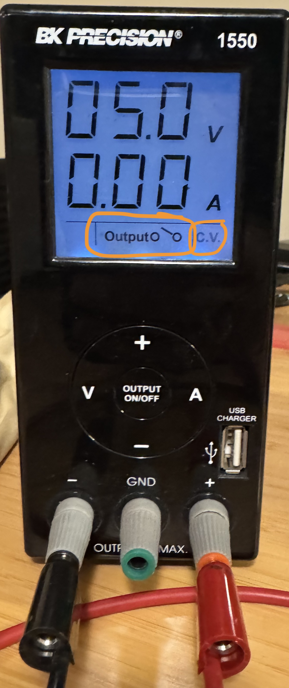
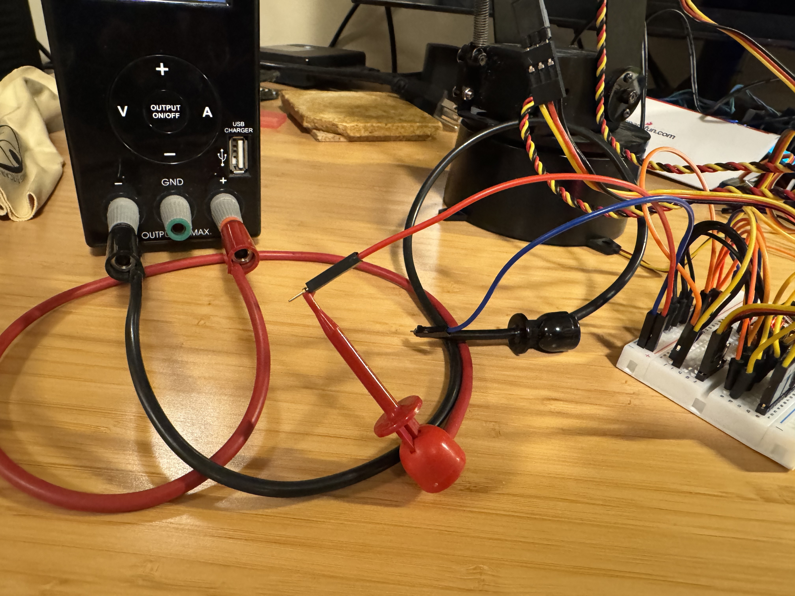
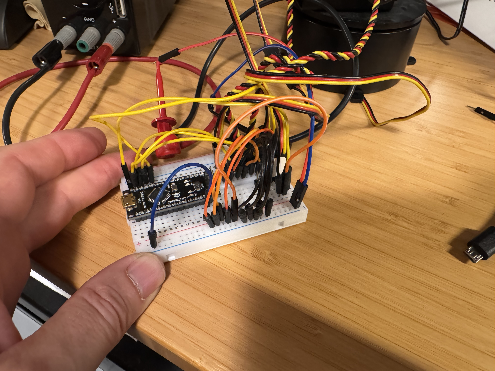
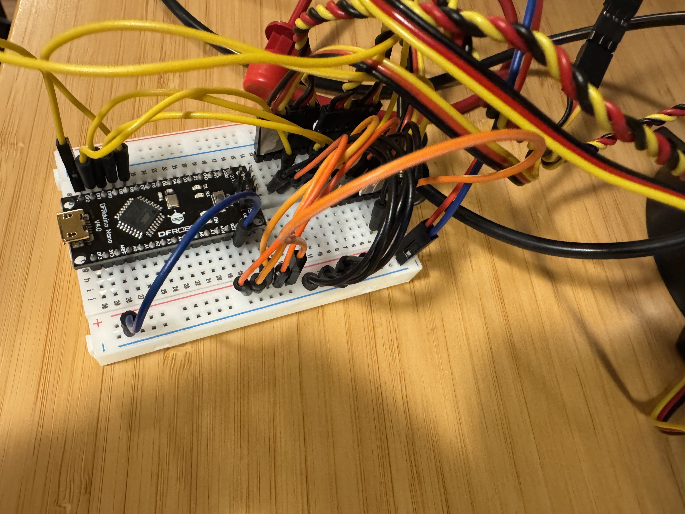

# Dexter

Dexter is a LynxMotion 5 degree of freedom robotic arm:

https://www.robotshop.com/products/lynxmotion-al5d-pltw-robotic-arm-assembled?qd=530dc00e929ed5d5be6091a0129e2fb0

It has five PWM-controlled servo motors.  The following code sets up five PWM-based servo control outputs on Arduino pins "D8" thru "D12" and sweeps all five motors between 70 and 110 degrees of rotation:

```
#include <Servo.h>

// Create five servo objects
Servo servo1;
Servo servo2;
Servo servo3;
Servo servo4;
Servo servo5;

int pos = 0;    // variable to store the servo position

void setup() {
  servo1.attach(8); // Servo 1 connected to digital pin 8
  servo2.attach(9); // Servo 2 connected to digital pin 9
  servo3.attach(10); // Servo 3 connected to digital pin 10
  servo4.attach(11); // Servo 4 connected to digital pin 11
  servo5.attach(12); // Servo 5 connected to digital pin 12
}

void loop() {
  for (pos = 70; pos <= 110; pos += 1) { 
    // in steps of 1 degree
    servo1.write(pos);
    servo2.write(pos);
    servo3.write(pos);
    servo4.write(pos);
    servo5.write(pos);
    delay(50);                       
  }
  for (pos = 110; pos >= 70; pos -= 1) { 
    servo1.write(pos);
    servo2.write(pos);
    servo3.write(pos);
    servo4.write(pos);
    servo5.write(pos);           
    delay(50);                       
  }
}
```

Dexter's servo motors are larger than the one you experimented with earlier, and they are connected to "things with mass" (each of the robots links, which may support more motors and links), so the servo motors require more power.  As such, Dexter's motors are powered by a BK Precision 1550 bench-top power supply:



The bottom of the power supply display should say "C.V." on the right side.  This means the power supply will provide a "Constant Voltage" output.  The display also reads "Output" and has two circles with a line between them that represents the "on" (line goes between two circles) and "off" (line is only connected to the right circle - as shown in the image above).  

The top number in the display should read "5.0" (Volts).  You can change this by pressing the + and - buttons on the keypad below the display.  Dexter should only be operated with a power supply output voltage setting of "5.0" (Volts).  Make sure the top number reads "5.0" before turning on the power supply.  

The power supply's output is turned on/off by pressing the "OUTPUT ON/OFF" button in the middle of the keypad below the display.

When the output is on, the second number (showing "0.0" Amps in the image above) will vary depending on how much current the power supply needs to provide to Dexter in order to maintain a constant output voltage of 5.0 Volts.  As the motors move you will see this number change.

Connect the black and red clip-leads to the power supply and Dexter's breadboard as shown in the images below.  The black clip-lead is connected to a blue jumper wire, which is connected to the blue horizontal row of pin sockets on the breadboard.  The red clip-lead is connected to a red jumper wire, which is connected to the red horizonal row of pin sockets on the breadboard:





Five black jumper wires go from the blue horizontal row of pin sockets to the black wires in each of the five cables going to Dexter's motors.  These are the motor's "0 V" connections.  Five orange jumper wires (because I ran out of red) go from the red horizontal row of pin sockets to the red wires in each of the five cables going to Dexter's motors.  These are the motor's "5 V" connections.

Five yellow jumper wires go from the Arduino's data pins D8-D12 (top left of the image below) to the yellow wires in each of the five cables going to Dexter's motors.  These are the PWM control signals.



Note in the image above a blue jumper going from the blue horizontal row on the breadboard to the Arduinos "GND" pin (#14 from the left edge in the image above).  ***This is a very important wire***.  It links the Arduino's "0V" (GND) pin to the BK Precision's "0V" output.  Strange things may happen if you omit this wire.

There are a lot of wires in this design.  One (or more) are sure to come loose.  If none of the motors work, check the wires from the BK Precision bench supply to the breadboard and check that the Arduino is powered and running code that generates PWM outputs.  If one of the motors isn't working, check the wiring from the motor's cable to the red & blue horizontal pin socket rows and to the Arduino board.

