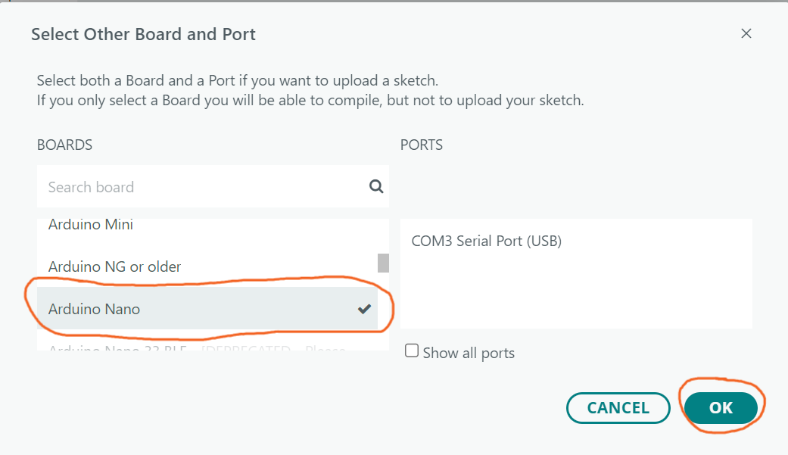
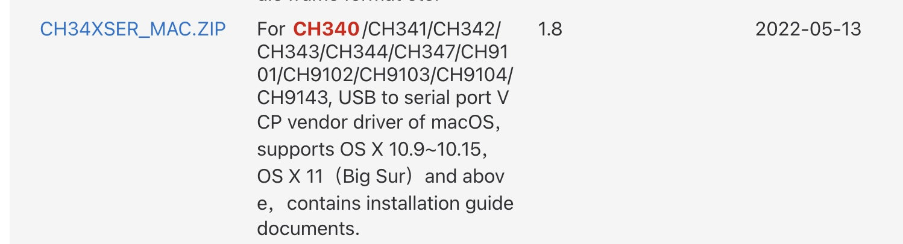
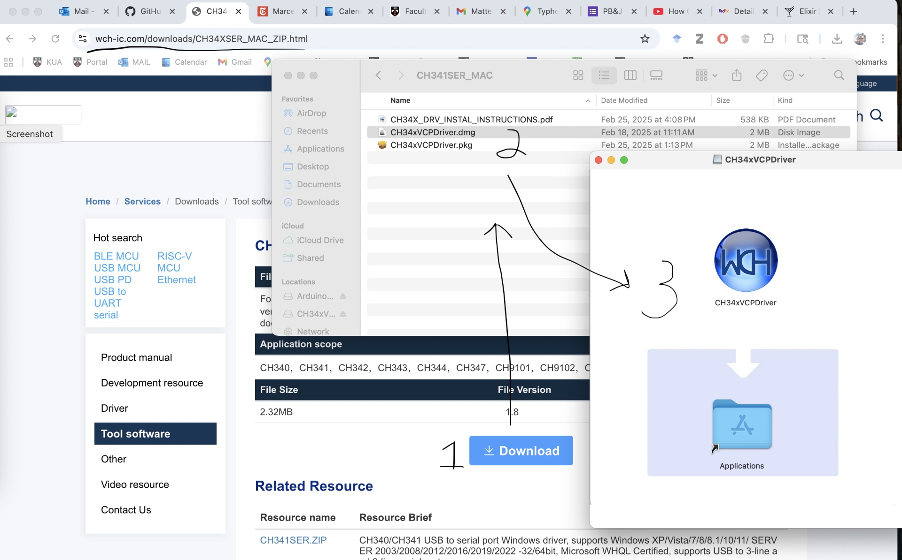
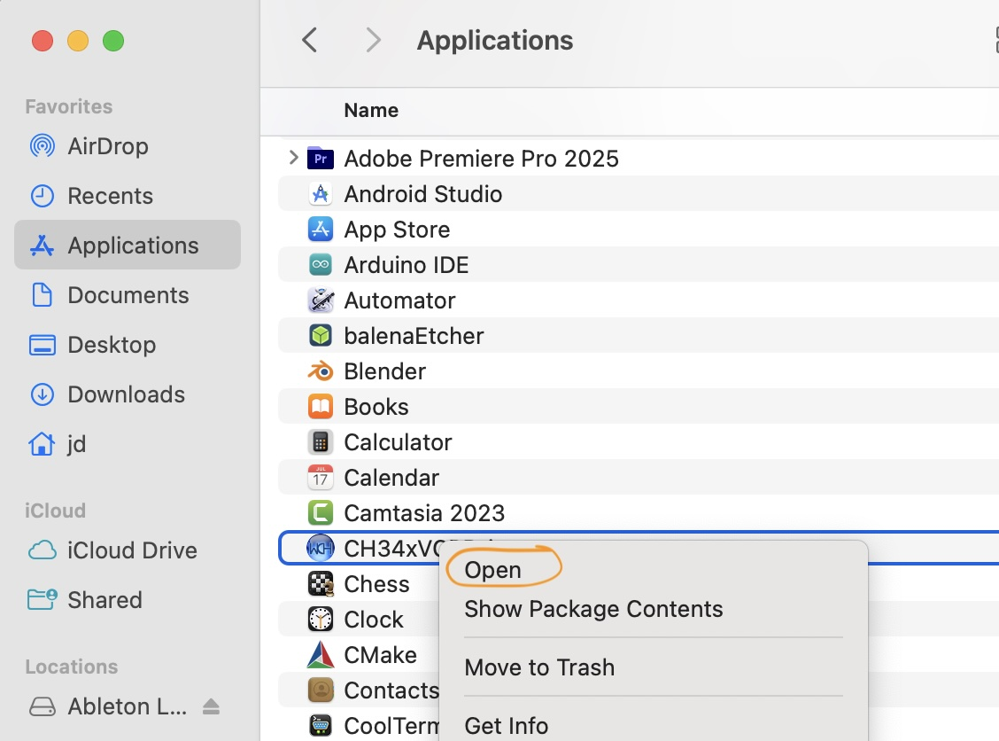
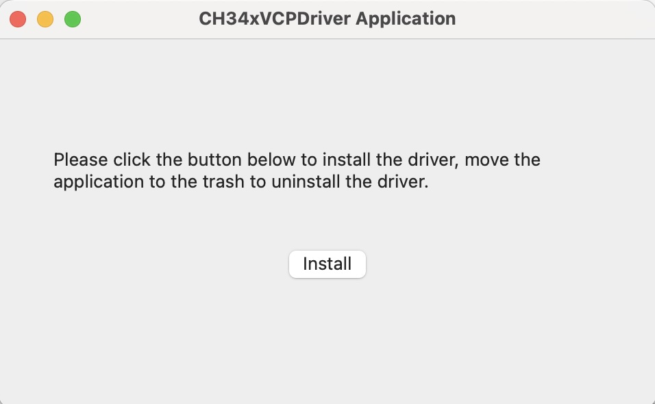
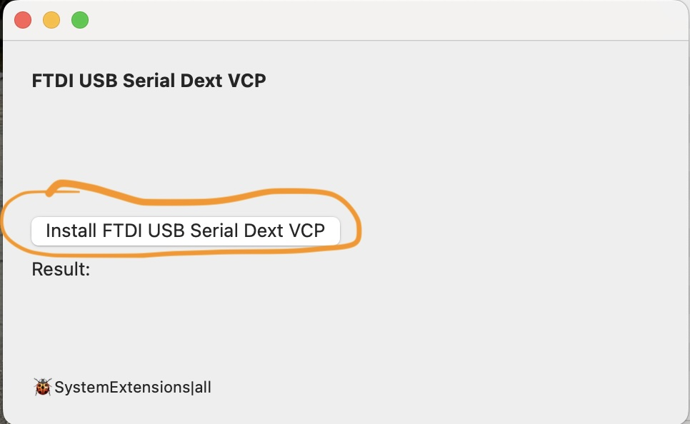
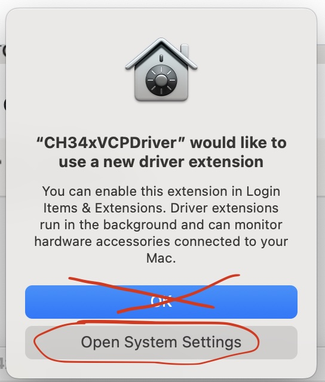
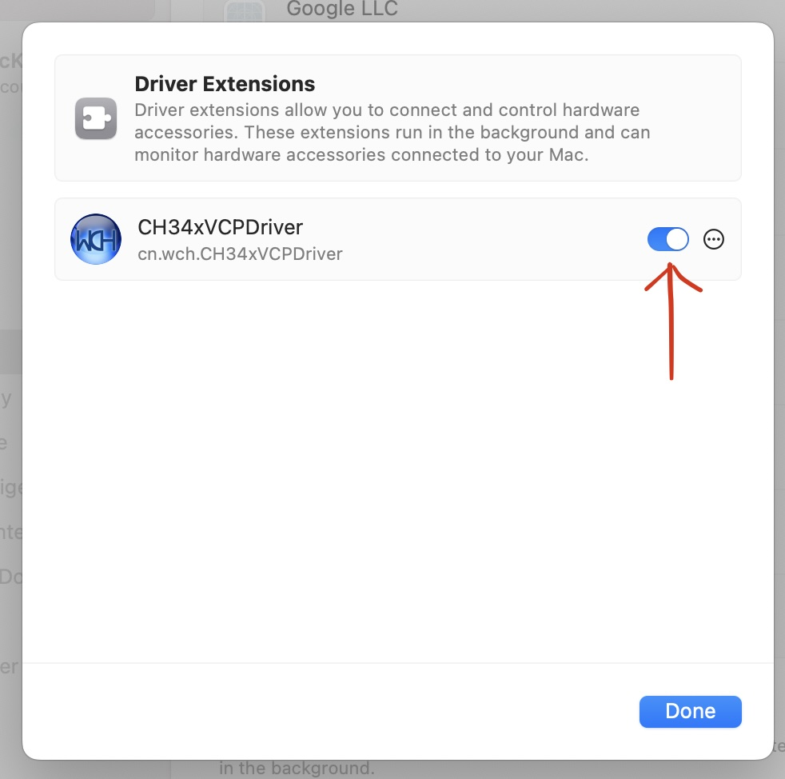

# KUA STEM Scholars

I look forward to meeting all of you!  I have a few stories to tell, a few thoughts to share, and I want to spend as much time as we can answering your questions.  I also want to have some fun with hardware along the way.  

In preparation for this, please try to complete the following three activities before we meet. 

Click the triangle to the left of each item below to expand the section:

<details>
  <summary>Install the Arduino Integrated Development Environment ("IDE") before we meet:</summary>

You can download the Arduino IDE from the following link:

https://www.arduino.cc/en/software/

After installing launch the Arduino IDE ("Integrated Development Environment").  It will take a while to open the first time you launch it.  The IDE downloads and installs additional software the first time it launches.  This is not unusual.

The installation process may (depending on your operating system... windows... osx... etc...) ask to install "device software" or "drivers."  Please install these as well:


When all of the installation processes complete your IDE window should resemble the following (the text displayed in your "Output" window may be different):


</details>

<details>
  <summary>Create an Ardino code project - also called a "sketch"</summary>

Open the Arduino IDE if it is not still / already open.

Click on the "Select Board" drop down menu and click on "Select other board and port...":


Scroll down the Boards list until you find "Arduino Nano" and click on it to select it.  A checkmark will appear to the right of the label.  You do not need to select any "PORTS" at this time.  Click the "OK" button.



The top section of the IDE is the code editor.  Replace the code in the code editor window with the following:

```
// The setup function runs once when the board is powered or reset
void setup() {
  pinMode(LED_BUILTIN, OUTPUT); // Initialize the built-in LED pin as an output
}

// The loop function runs repeatedly
void loop() {
  digitalWrite(LED_BUILTIN, HIGH); // Turn the LED on
  delay(1000); // Wait for 1 second
  digitalWrite(LED_BUILTIN, LOW); // Turn the LED off
  delay(1000); // Wait for 1 second
}
```

Your IDE window should resemble the following:


Then click on the "File" menu button and select "Save As":


Arduino code projects are referred to as "sketches."  Save your sketch as "blinky"  You can save this file wherever you like - just be sure you can find it again when we meet!:


The tab at the top of your editor window should update with the new name for your sketch.  Sketch files end with the text ".ino":


</details>

<details>
  <summary>Verify your sketch</summary>

Click on the checkmark icon above the code editor to verify your sketch.  


This will run a tool ("compiler") that converts your code into an executable image ("firmware") that can run on the board (the Ardunio Nano) you selected when we created the sketch:


If the verification ("compilation") process is successful the output area of your IDE should display some information about the firmware you just compiled:


My output, above, is telling me that the size of my program's executable code - the instructions that the microcontroller's processor will run - is 924 bytes... using up 3% of my microcontroller's available storage space for the executable code.  It is also telling me that my program needs 9 bytes, or "less than 1%" of my microcontroller's available memory.  

If your output does not resemble mine check that the code in your code editor is *identical* to the code in the "Create an Arduino code project" section above and try again.  If this still does not work do not worry, we will fix it when we meet.
</details>

<details>
  <summary>ADDITIONAL STEP FOR MAC USERS (ONLY): Manual Device Driver Installation (Optional)</summary>

<br>

Mac users with "Apple Silicon" (most recent MacBooks) need to manually install driver software to work with the hardware in this Thursday's seminar. 


Installing the driver requires a few steps; it is easy to make a mistake and get lost in the process.  Driver installation is *optional* - you can always work with someone who has a Windows based laptop if you do not wish to install the drivers on your computer / have problems installing the drivers.  You can also ask for help from KUA's Information Technology folks (they are aware of the need to manually install drivers on OSX laptops and have offered to help).

Start by downloading the driver zip archive from the vendor's website:

https://www.wch-ic.com/search?q=CH340&t=downloads

Scroll down to the archive for macOS and click on the file link (CH34XSER_MAC.ZIP) to download it:



When the file downloads, open the downloaded zip archive and copy the application inside of it into your /Applications folder.  OSX System Security requires that you run the downloaded program from inside the Applications folder because it adds an extension to the system (to work with the Arduino Nano board over the USB interface).  



Next open the Applications folder and *right-click* on the file to open the context menu, then click on "Open."  This is (reportedly) necessary to guarantee the installer opens the Security Extensions dialog box in a future step:



You will be prompted to confirm you want to install the driver.  Click "install":



When the installation dialog box appears, click on the "Install FTDI USB Serial Dext VCP" button:



***The next step is the one I always make a mistake on!!!***

When the following prompt appears, do not accept the default action of "OK"... instead click on the button to "Open System Settings":



When the following dialog box appears, slide the switch to the right of "CH34xVCPDriver" from the left to the right (you may need to enter your password to do this):



After you close the System Settings dialog box the Driver Installation utility should report "Success":


If you have any problems with the above process I recommend uninstalling the driver by dragging the installer tool from the /Applications folder to the trash.  This will un-install any system extensions as well.  Then start over by dragging the installation application from the zip archive to the /Applications folder again.  You can also reach out to KUA Information Technology for help.
</details>

<br>

When we meet, please bring your laptop (*fully charged*) so you can upload and run this sketch on your own hardware (which I will bring) as a starting point for additional hardware experiments!

The other thing I would like to ask of you, before we meet, is a few sentences telling me something about your STEM interests... what inspires you in the field of STEM?  

Please use my Dartmouth e-mail address, jason.m.dahlstrom@dartmouth.edu, and please include "KUA STEM Scholar" in the subject line so I am sure to read it before we meet.

Thanks for your time ahead of our seminar, and again, I look forward to meeting you!

-Jason

